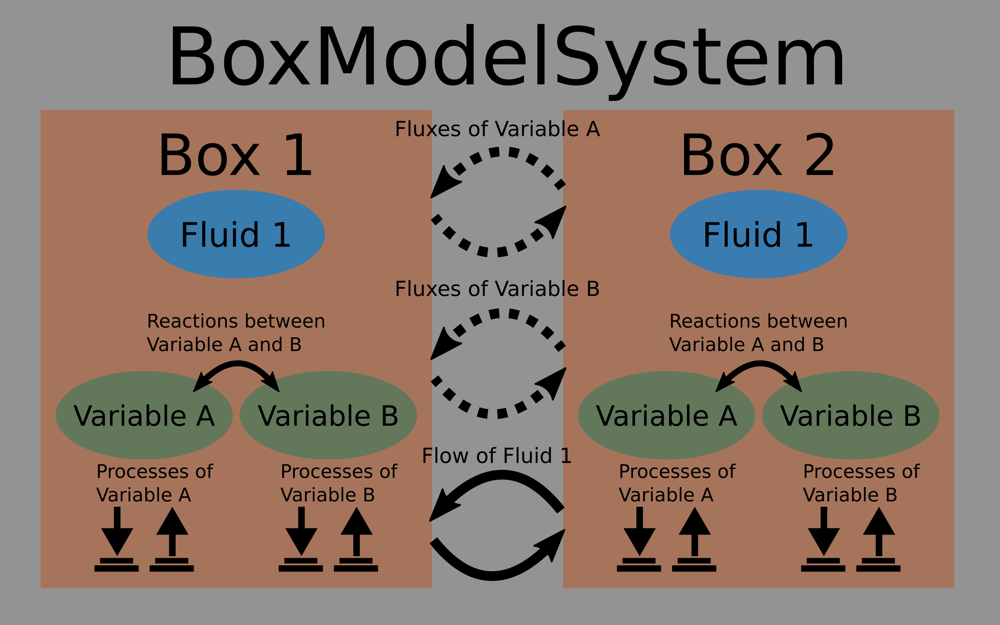
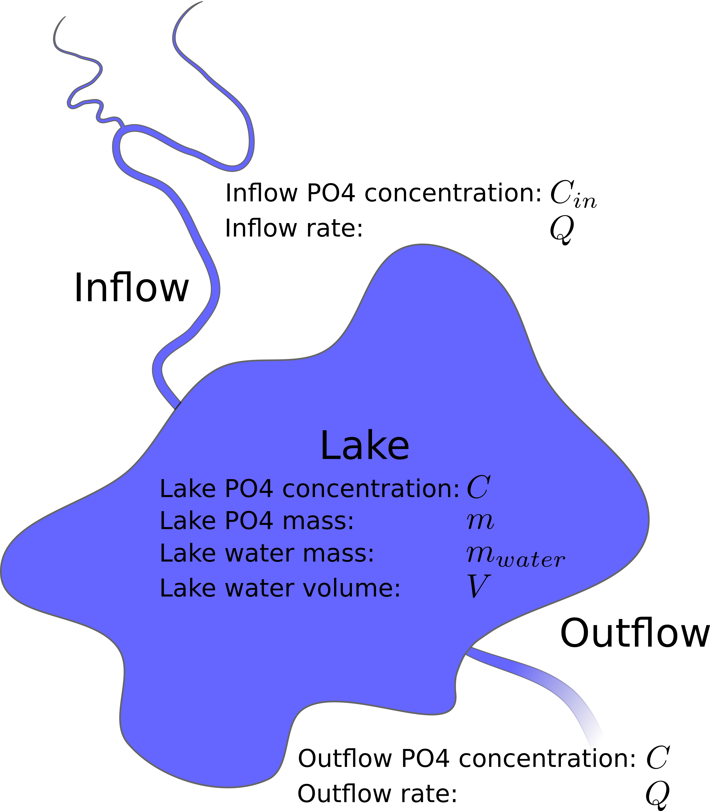

boxsimu
===================

boxsimu is a simple simulation software that allows the 
user to model/simulate simple to intermediate complex boxmodel-systems.
It offers a user friendly interface to generate boxes, processes and 
reactions that take place inside these boxes, and flows/fluxes that 
describe how boxes exchange fluid and variable mass. Once a system is
defined with boxsim, its temporal resolution can easily be solved using 
the ```solve()``` function.

Structure of boxsimu
===================
The following graphic shows the basic structure of a system definition 
in boxsimu:

In this diagram an instance of BoxModelSystem is shown that contains 
two boxes: 'Box 1' and 'Box 2'.  Both boxes contain the same fluid 
('Fluid 1') and two instances of the class Variable ('A' and 'B'). 
Additionally both boxes can contain an arbitrary number of independet 
processes and reactions of these variables. Finally, the boxes exchange 
mass of the variables and the fluid via fluxes and flows.

Code example
===================
In the following a simple code example is given which purpose is to 
simulate the temporal evolution of phosphate in this system:

```python
import boxsimu
from boxsimu import ur

# FLUIDS
freshwater = boxsimu.Fluid('freshwater', rho=1000*ur.kg/ur.meter**3)

# VARIABLES
po4 = boxsimu.Variable('po4')

# BOXES
lake = boxsimu.Box(
    name='lake',
    description='Little Lake',
    fluid=freshwater.q(m_water),
    variables=[po4.q(m_0)],
)

# FLOWS
inflow = boxsimu.Flow(
    name='Inflow', 
    source_box=None,
    target_box=lake,
    rate=flow_rate,
    tracer_transport=True,
    concentrations={po4: 3e-1 * ur.gram / ur.kg}, 
)

outflow = boxsimu.Flow(
    name='Outflow',
    source_box=lake,
    target_box=None,
    rate=flow_rate,
    tracer_transport=True,
)

# FLUXES
# No fluxes in this system

# BOXMODELSYSTEM
system = boxsimu.BoxModelSystem(
    name='lake_system', 
    description='Simple Lake Box Model',
    boxes=[lake,], 
    flows=[inflow, outflow,],
)
An detailed explanation what the code does is given in the Tutorial
(examples/Tutorial.ipynb).
